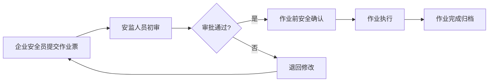

## 1. 产品概述

危化品企业安全监管 Web 系统是为化工园区安监人员和企业安全员打造的一体化安全管理平台，实现危化品企业全生命周期安全监管数字化。

系统涵盖企业档案管理、风险源管控、作业票证审批、巡检整改闭环、事故苗头预警、监管报表统计等核心功能，提升园区安全管理效率，降低安全事故风险。

## 2. 核心功能

### 2.1 用户角色

| 角色 | 注册方式 | 核心权限 |
|------|----------|----------|
| 园区安监人员 | 系统管理员分配 | 园区总览查看、企业监管、报表统计、审批作业票、预警处理 |
| 企业安全员 | 系统管理员分配 | 企业信息维护、作业票提交、巡检执行、整改上报、数据查看 |

### 2.2 功能模块

1. **园区总览**：数据看板、风险分布、预警提醒、实时动态
2. **企业档案**：企业基础信息、资质管理、储罐/仓库信息、承包商管理、培训记录、应急物资
3. **风险源管理**：重大危险源分级、风险评估、风险分布地图
4. **作业票证**：动火作业票、受限空间作业票、审批流转、作业前确认、超期预警
5. **巡检整改**：巡检路线配置、巡检任务、异常上报、整改闭环
6. **事故苗头**：事故苗头登记、原因分析、防范措施、值班交接
7. **监管报表**：企业评分、统计分析、趋势图表、超期预警汇总

### 2.3 页面详情

| 页面名称 | 模块名称 | 功能描述 |
|----------|----------|----------|
| 园区总览 | 数据看板 | 企业数量、风险源数量、待处理预警、今日作业票统计 |
| 园区总览 | 风险分布图 | 地图展示各企业风险等级分布 |
| 园区总览 | 预警提醒 | 气象风险、超期预警、异常事件实时提醒 |
| 园区总览 | 动态列表 | 最新作业票、巡检记录、整改动态 |
| 企业档案 | 企业列表 | 企业信息列表、搜索筛选、详情查看 |
| 企业档案 | 资质管理 | 企业资质证书上传、有效期管理、超期提醒 |
| 企业档案 | 储罐仓库 | 储罐信息维护、仓库信息维护、容量/介质管理 |
| 企业档案 | 承包商管理 | 承包商登记、资质审核、人员管理 |
| 企业档案 | 培训记录 | 安全培训登记、人员考核、培训档案 |
| 企业档案 | 应急物资 | 应急物资盘点、库存管理、有效期提醒 |
| 风险源管理 | 危险源列表 | 重大危险源登记、分级管理 |
| 风险源管理 | 风险评估 | 风险等级评定、管控措施 |
| 风险源管理 | 风险地图 | 危险源空间分布可视化 |
| 作业票证 | 票证列表 | 动火/受限空间作业票列表、状态筛选 |
| 作业票证 | 新建票证 | 在线填写作业票、附件上传 |
| 作业票证 | 审批流转 | 多级审批、审批意见、状态跟踪 |
| 作业票证 | 作业确认 | 作业前安全确认、签字确认 |
| 作业票证 | 超期预警 | 作业票超期提醒、资质超期预警 |
| 巡检整改 | 路线配置 | 巡检点设置、巡检路线规划 |
| 巡检整改 | 巡检任务 | 巡检任务分配、巡检记录、异常拍照上报 |
| 巡检整改 | 整改管理 | 整改通知、整改反馈、验收闭环 |
| 事故苗头 | 苗头登记 | 事故苗头信息登记、分类管理 |
| 事故苗头 | 原因分析 | 根因分析、改进措施 |
| 事故苗头 | 值班交接 | 值班记录、交接班信息 |
| 监管报表 | 企业评分 | 分企业安全评分、排名展示 |
| 监管报表 | 统计分析 | 多维度统计图表、趋势分析 |
| 监管报表 | 预警汇总 | 各类预警汇总统计 |

## 3. 核心流程

### 3.1 作业票证审批流程

### 3.2 巡检整改闭环流程

## 4. 用户界面设计

### 4.1 设计风格

- **主色调**：深蓝色 (#1e3a5f) 作为主色，代表专业、稳重、安全
- **辅助色**：橙色 (#f59e0b) 用于预警提醒，绿色 (#10b981) 用于安全/正常状态，红色 (#ef4444) 用于危险/警告
- **中性色**：浅灰背景 (#f8fafc)，深灰文字 (#1e293b)，白色卡片 (#ffffff)
- **按钮风格**：圆角 6px，轻微阴影，悬停有颜色加深效果
- **字体**：使用 "Noto Sans SC" 中文无衬线字体，标题 18-24px，正文 14px
- **布局风格**：左侧导航 + 顶部工具栏 + 主内容区的经典后台布局，卡片式内容展示
- **图标风格**：使用 Lucide 图标库，线性图标，统一 20px 尺寸

### 4.2 页面设计概览

| 页面名称 | 模块名称 | UI 元素 |
|----------|----------|---------|
| 园区总览 | 数据看板 | 4 个统计卡片，带渐变背景和图标，数字动画效果 |
| 园区总览 | 风险分布图 | 园区地图，企业标记点按风险等级着色，悬停显示详情 |
| 园区总览 | 预警提醒 | 彩色标签列表，重要预警闪烁动画 |
| 园区总览 | 动态列表 | 时间线样式，最新条目高亮显示 |
| 企业档案 | 企业列表 | 表格布局，支持分页、搜索、筛选，操作按钮组 |
| 企业档案 | 详情页 | 标签页切换，信息分组展示，附件预览 |
| 作业票证 | 票证列表 | 状态标签彩色区分，审批进度条展示 |
| 作业票证 | 表单页 | 分组表单，必填项标记，表单验证提示 |
| 巡检整改 | 地图展示 | 巡检点标记，路线连线，完成状态着色 |
| 监管报表 | 图表展示 | ECharts 柱状图、折线图、饼图，支持数据钻取 |

### 4.3 响应式设计

- 采用桌面优先设计，适配 1366px 及以上分辨率
- 侧边栏在小屏幕可折叠收起
- 表格组件支持横向滚动
- 表单在中等屏幕自适应两列布局

### 4.4 交互动效

- 页面切换使用淡入过渡效果
- 数据卡片悬停时轻微上浮阴影加深
- 按钮点击有缩放反馈
- 预警条目有呼吸灯动画效果
- 统计数字有计数动画
