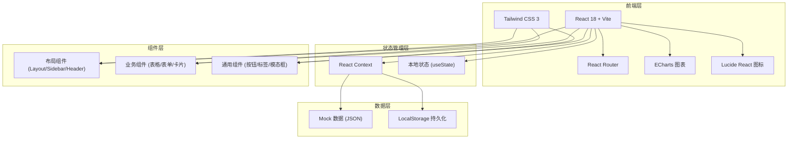

## 1. 架构设计



## 2. 技术栈说明

- **前端框架**：React 18 + TypeScript
- **构建工具**：Vite 5
- **样式方案**：Tailwind CSS 3
- **路由管理**：React Router DOM 6
- **图表库**：ECharts 5 + echarts-for-react
- **图标库**：Lucide React
- **数据模拟**：本地 Mock 数据 + LocalStorage
- **UI 组件**：基于 Tailwind CSS 自定义组件，不引入重型 UI 库

## 3. 目录结构

```
src/
├── assets/              # 静态资源
├── components/          # 通用组件
│   ├── layout/         # 布局组件
│   ├── ui/             # 基础 UI 组件
│   └── charts/         # 图表组件
├── pages/              # 页面组件
│   ├── Dashboard/      # 园区总览
│   ├── Enterprise/     # 企业档案
│   ├── RiskSource/     # 风险源管理
│   ├── WorkTicket/     # 作业票证
│   ├── Inspection/     # 巡检整改
│   ├── Incident/       # 事故苗头
│   └── Reports/        # 监管报表
├── context/            # 状态管理
├── data/               # Mock 数据
├── types/              # TypeScript 类型定义
├── utils/              # 工具函数
├── App.tsx
├── main.tsx
└── index.css
```

## 4. 路由定义

| 路由 | 页面 | 说明 |
|------|------|------|
| / | 园区总览 | 数据看板、风险分布、预警提醒 |
| /enterprise | 企业档案 | 企业列表、资质管理 |
| /enterprise/:id | 企业详情 | 企业信息、储罐仓库、承包商等 |
| /risk | 风险源管理 | 危险源列表、风险地图 |
| /ticket | 作业票证 | 票证列表、新建/审批 |
| /ticket/:id | 票证详情 | 票证信息、审批流程 |
| /inspection | 巡检整改 | 巡检路线、任务管理 |
| /incident | 事故苗头 | 苗头登记、值班交接 |
| /reports | 监管报表 | 企业评分、统计分析 |

## 5. 数据模型

### 5.1 核心数据结构

```typescript
// 企业信息
interface Enterprise {
  id: string;
  name: string;
  code: string;
  type: string;
  address: string;
  contact: string;
  phone: string;
  riskLevel: 'high' | 'medium' | 'low';
  qualifications: Qualification[];
  tanks: Tank[];
  warehouses: Warehouse[];
  contractors: Contractor[];
  trainingRecords: TrainingRecord[];
  emergencyMaterials: EmergencyMaterial[];
  score: number;
  createdAt: string;
}

// 资质证书
interface Qualification {
  id: string;
  enterpriseId: string;
  name: string;
  number: string;
  issueDate: string;
  expiryDate: string;
  status: 'valid' | 'expiring' | 'expired';
  fileUrl?: string;
}

// 储罐信息
interface Tank {
  id: string;
  enterpriseId: string;
  name: string;
  code: string;
  capacity: number;
  medium: string;
  hazardLevel: string;
  status: 'normal' | 'maintenance' | 'abnormal';
}

// 仓库信息
interface Warehouse {
  id: string;
  enterpriseId: string;
  name: string;
  area: number;
  category: string;
  items: string;
  status: 'normal' | 'abnormal';
}

// 承包商
interface Contractor {
  id: string;
  enterpriseId: string;
  name: string;
  qualification: string;
  contact: string;
  phone: string;
  status: 'active' | 'inactive';
}

// 培训记录
interface TrainingRecord {
  id: string;
  enterpriseId: string;
  title: string;
  date: string;
  participants: number;
  content: string;
  trainer: string;
}

// 应急物资
interface EmergencyMaterial {
  id: string;
  enterpriseId: string;
  name: string;
  quantity: number;
  unit: string;
  expiryDate?: string;
  location: string;
}

// 重大危险源
interface HazardSource {
  id: string;
  enterpriseId: string;
  enterpriseName: string;
  name: string;
  level: 'one' | 'two' | 'three' | 'four';
  type: string;
  location: string;
  controlMeasures: string;
  status: 'normal' | 'warning' | 'danger';
  lng?: number;
  lat?: number;
}

// 作业票证
interface WorkTicket {
  id: string;
  ticketNo: string;
  type: 'hot' | 'confined';
  enterpriseId: string;
  enterpriseName: string;
  location: string;
  workContent: string;
  applicant: string;
  applyTime: string;
  planStartTime: string;
  planEndTime: string;
  status: 'draft' | 'pending' | 'approved' | 'rejected' | 'in_progress' | 'completed' | 'cancelled';
  approvalRecords: ApprovalRecord[];
  preCheckItems: PreCheckItem[];
  files?: string[];
}

// 审批记录
interface ApprovalRecord {
  id: string;
  ticketId: string;
  approver: string;
  role: string;
  opinion: string;
  status: 'approved' | 'rejected';
  time: string;
}

// 作业前确认项
interface PreCheckItem {
  id: string;
  ticketId: string;
  item: string;
  checked: boolean;
  checkedBy?: string;
  checkedTime?: string;
}

// 巡检路线
interface InspectionRoute {
  id: string;
  enterpriseId: string;
  name: string;
  points: InspectionPoint[];
  frequency: string;
  status: 'active' | 'inactive';
}

// 巡检点
interface InspectionPoint {
  id: string;
  routeId: string;
  name: string;
  location: string;
  content: string;
  order: number;
}

// 巡检任务
interface InspectionTask {
  id: string;
  routeId: string;
  routeName: string;
  enterpriseId: string;
  inspector: string;
  startTime: string;
  endTime?: string;
  status: 'pending' | 'in_progress' | 'completed';
  records: InspectionRecord[];
  abnormalCount: number;
}

// 巡检记录
interface InspectionRecord {
  id: string;
  taskId: string;
  pointId: string;
  pointName: string;
  checkTime: string;
  status: 'normal' | 'abnormal';
  description?: string;
  photos?: string[];
}

// 整改通知
interface Rectification {
  id: string;
  source: string;
  sourceId: string;
  enterpriseId: string;
  enterpriseName: string;
  title: string;
  description: string;
  deadline: string;
  status: 'pending' | 'in_progress' | 'completed' | 'verified';
  feedback?: string;
  feedbackTime?: string;
  verifier?: string;
  verifyTime?: string;
}

// 事故苗头
interface Incident {
  id: string;
  enterpriseId: string;
  enterpriseName: string;
  title: string;
  category: string;
  date: string;
  location: string;
  description: string;
  causeAnalysis: string;
  measures: string;
  reporter: string;
  status: 'reported' | 'processing' | 'closed';
}

// 值班记录
interface DutyRecord {
  id: string;
  date: string;
  shift: string;
  dutyPerson: string;
  handoverContent: string;
  nextDutyPerson: string;
  handoverTime: string;
}

// 企业评分
interface EnterpriseScore {
  id: string;
  enterpriseId: string;
  enterpriseName: string;
  totalScore: number;
  safetyManagement: number;
  riskControl: number;
  operationStandard: number;
  training: number;
  emergency: number;
  rank: number;
  month: string;
}
```

### 5.2 数据初始化

使用 Mock 数据模拟真实场景，包含：
- 5-8 家企业数据
- 每个企业 2-3 个储罐/仓库
- 10-15 个重大危险源
- 20-30 张作业票证（各状态均有）
- 10-15 条巡检记录
- 5-8 条事故苗头记录
- 企业评分数据

## 6. 核心组件设计

### 6.1 布局组件
- `Layout`：整体布局容器，包含侧边栏和主内容区
- `Sidebar`：左侧导航菜单，支持折叠
- `Header`：顶部工具栏，包含用户信息和通知
- `PageContainer`：页面容器，统一内边距和标题

### 6.2 通用组件
- `DataTable`：通用表格组件，支持分页、排序、筛选
- `StatusBadge`：状态标签组件，根据状态显示不同颜色
- `StatCard`：统计卡片组件，用于数据看板
- `Modal`：模态框组件
- `FormItem`：表单项组件
- `Timeline`：时间线组件

### 6.3 业务组件
- `RiskMap`：风险分布地图（使用 SVG 模拟地图）
- `TicketProgress`：作业票审批进度组件
- `ScoreRadar`：企业评分雷达图
- `WarningList`：预警列表组件
